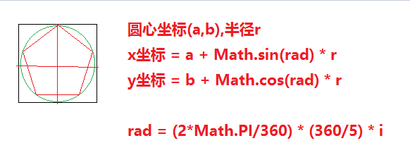
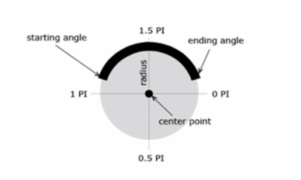
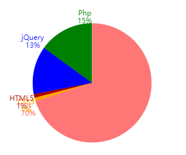
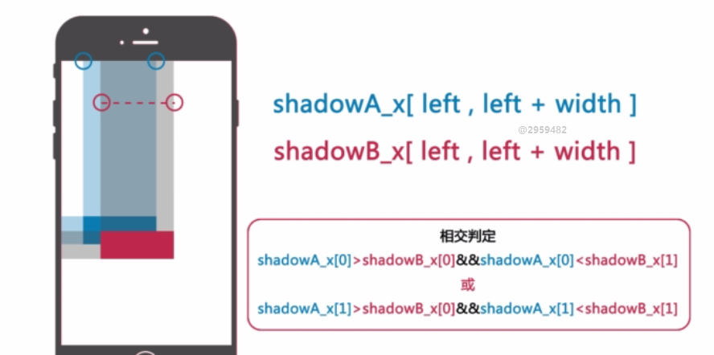

# H5可视化数据报告开发
## 开发流程
### 开发前  ->  开发中  -> 开发后
> 开发前: 产品设计(产品经理)、视觉/交互设计(UI/UE)
> 开发中: 技术规划(需求是否合理、代码是否可以复用、复杂功能是否可以拆分)、前端开发、后端开发
> 开发后: 测试(功能/性能测试)、上线(运维)
## 角色
> PM: 产品经理(MRD)
> PM: 项目经理(设计文档)
> UI: 美工(PSD)
> UE: 设计(AXURE)
> FE: 前端
> RD/BE: 后端
> QA: 测试
> OP: 运维
## 产品设计
> 1.首页载入动画、滑动切换页面、内容页
## 开发规划
> 产品设计 <-> 技术经理 <-> 技术开发
> 项目开发文档: 可行性确认、技术选型、开发/线上环境规划、技术开发方案设计、团队协作方式
## 技术开发方案设计
### jquery方式实现
#### 1.页面DOM操作
>   技术选型: jQuery
>   简介: 一款轻量级JS框架
>   特点: 强大的选择器、出色的DOM操作封装、可靠的事件处理机制
#### 2.页面切换功能
>   技术选型: FullPage.js插件
>   简介: jQuery插件
>   特点: API简单、易用、跨浏览器
#### 3.组织内容结构方案: Page --- Component
#### 4.技术点
>   HTML+CSS: 柱图Bar-垂直柱图Bar_v、散点图Point
>   Canvas: 折线图Polyline、雷达图Radar、饼图pie-环图ring
#### 5.开发步骤
##### 验证页切换，组件切换:入场、出场动画 - demo_jquery/test/test-valid.html
##### JS对象规划: 

内容组织类 H5 - 组织报告内容结构(组件)、设置报告切换效果(当页切换时，通知页内所有组件)
> 方法: 添加一个页 addPage、添加一个组件 addComponet、展现所有页面 loader

图文组件类 H5ComponentBase - 输出一个DOM，内容可以图片或文字
> 事件: 当前页载入 - onLoad，当前页移出 - onLeave，知道这些就可以控制动画

图表组件类 H5Component - 在H5ComponentBase基础上插入DOM结构或CANVAS图形
> 事件: 当前页载入/移出，图表组件本身的生长动画
> 图表组件:
>   1.散点图原理:
>   var data = [['A项',0.4,'green'],['B项',0.2,'yellow',0,'-120%']]
>   以第一项数据为基准，手动设置其它数据的偏移，相对第一个数据进行缩放
>   2.柱图: 水平/垂直
>   var data = [['Javascript', .4, '#ff7676'],['HTML/CSS', .2]]
>   name - process(per) - bg
>   3.折线图
>   数据同柱图，网格线背景，折线层
>   4.雷达图
>   数据同柱图，网格背景，伞骨图
>   多边形顶点坐标计算
>   
>   5.饼图
>   数据之和不能超过1，底图层/蒙版层(用于动画)，数据层
>   
>   
>   如果数据非常小，会造成文本重叠，这样就需要做进一步处理
>   
>   
>   使用投影检测法来处理
>   
>   
>   
>   6.环图
>   只有一个数据，继承饼图

loading
> 

#### CSS样式规划
```<div class="h5_component h5_component_base h5_component_name_myname"></div>```
> h5_component 表明这是一个组件，JS获取某页所有组件$(thisPage).find('.h5_component')
> h5_component_base 表明这是某个类型的组件，h5_component_pie、h5_component_point....用于某类样式的附加，还包含它们的状态_load、_leave
> h5_component_name_myname 自定义组件名，用于附加样式，例如通用的~_caption

  


### vue方式实现
**查看demo_vue**
